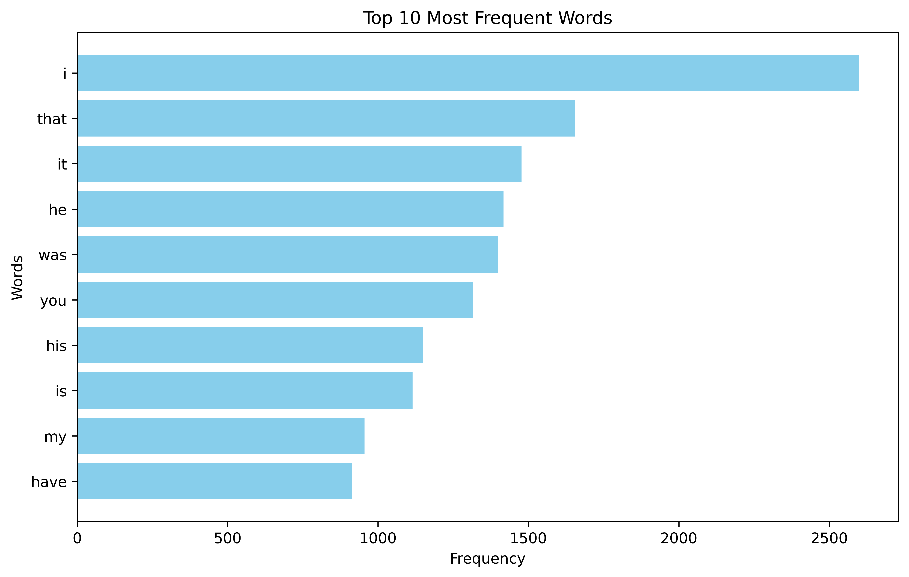

# Word Frequency Analysis

This project performs a word frequency analysis on the text of "Sherlock Holmes" by Arthur Conan Doyle, using asyncio and MapReduce principles.

## Results

The table below shows the top 10 most frequent words (excluding common words) found in the text:

| Word | Frequency |
|------|-----------|
| i | 2600 |
| that | 1655 |
| it | 1477 |
| he | 1417 |
| was | 1399 |
| you | 1317 |
| his | 1150 |
| is | 1115 |
| my | 955 |
| have | 913 |

## Visualization

## Notes
- Common words (stop words) have been excluded from the analysis
- The text has been converted to lowercase for consistent counting
- Punctuation has been removed
